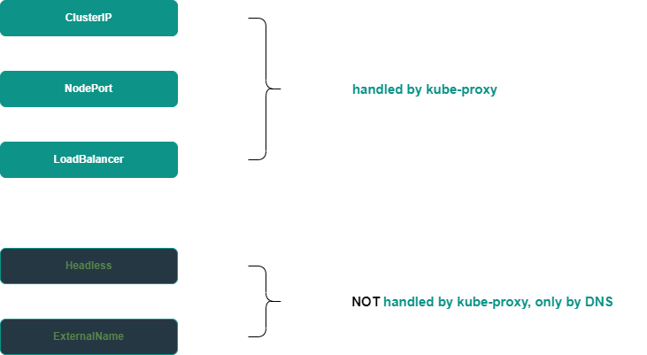
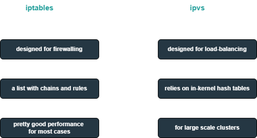

# Kubernetes Services: Introduction
When you have a Deployment with multiple Pods running in a cluster, at some point, you will need to provide access to the Deployment resources for either internal workloads or external clients. However, the IP addresses of Pods change over time, so it is not the best solution to rely on them. Kubernetes offers a better approach, which is to use a Service.
## What is a Service?
A **Service** is a kind of an abstraction created for a group of Pods. It provides a stable IP address, that you can always use to access the resources the Service represents.

From a networking perspective, a Service consists of two parameters: an **IP address** (sometimes called a virtual IP) and a **Port**.  They are used by other workloads in the cluster that want to access the resources represented by the given Service instance. These resources, called Service Endpoints, most often are Pods. The Service’s IP address and Port are ultimately translated into its Endpoints’ IP addresses and Ports. Every single request incoming to the Service is handled by one of the Service’s Endpoints, which means that the Service also provides a load-balancing mechanism.
### Groups of Services
Services can be divided into two groups, based on the way they are implemented. One group is handled by the so-called kube-proxy, the other one is only handled by DNS.

## What is kube-proxy?
kube-proxy is the default implementation of the Service concept in Kubernetes, it is a network proxy that runs on every node in a cluster. Since every Service implemented by kube-proxy is uniform within a cluster, not specific to a given node, this impacts the way load-balancing is performed. It is done on a per cluster basis, regardless of where the traffic to be handled is coming from.
### Types of kube-proxy Services
There are three types of Services that are handled by kube-proxy:
- **ClusterIP**: the basic Service in Kubernetes, is used for the intra-cluster communication.
- **NodePort**: is used when you need to access some Pods deployed in the cluster from the outside. The other workloads deployed in the Cluster can access your Pods using a virtual IP address assigned to the Service, while external clients use the IP addresses of the cluster nodes.
- **LoadBalancer**: assumes the use of a cloud load balancer, which can be relatively easily and quickly launched in the cloud and integrated with the cluster. External clients do not send their requests directly to the cluster nodes, instead, they use the load balancer IP address, which can be public. 
## Modes of kube-proxy operation
kube-proxy offers three modes of operation:
1. **iptables**: packets in the pipeline are processed via multiple custom chains, populated with appropriate rules.
2. **ipvs**: relies on the in-kernel hash tables rather than making use of chains of rules.
3. **userspace** (legacy mode): old and slow, not recommended.
### Which mode to select?
Despite the non-optimal structure of iptables (*as the number of Services increase, the list of chains and rules can become very long*), this mode still ensures good load-balancing performance in most cases, if the total number of Services doesn’t reach 1000.

In short, if the total number of configured Services is in the **thousands**, you should use kube-proxy in the ipvs mode, otherwise the iptables mode will be enough for load-balancing.
# Conclusion
Kubernetes Services provide a convenient and safe way to organize access to the resources in your Deployment via a stable IP address. You can choose the type of the Service according to your Deployment needs and run the Service in the mode that corresponds to your cluster scale.   
